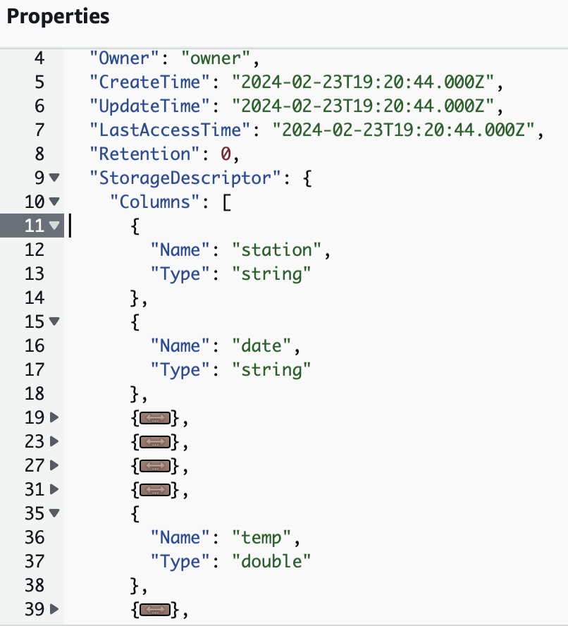
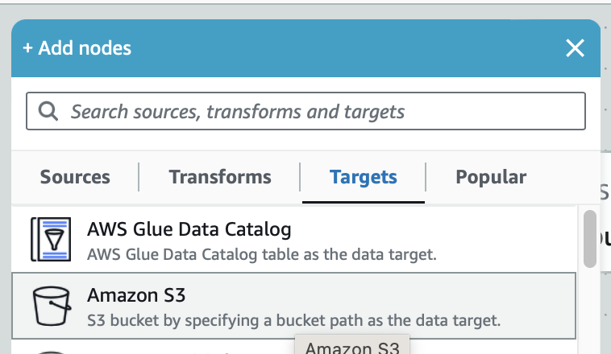

# Data Processing - AWS Glue Crawler & ETL Job
### Objectives:
Use Glue crawler to scan data in S3, infer data schema.

### Note about Source Data:

Subset of NOAA Global Surface Summary of Day dataset - collection of daily weather measurements including temperature, wind speed, humidity, pressure from 9k+ weather stations around the world. [Sample data](attachments/sample.csv) attached.

### Important Steps
1. Create a Glue crawler to scan the data in S3, infer the schema of the data, and filter data that will be included in the Data Catalog.
    
    
    
    
    
    
    
   * Note: The given source data S3 buckets contains many subfolders, named with year. Files matching the specified pattern would be skipped. In this example, we are skipping all data created for 19 century, 200* year,  2010~2012 year, which leaves weather data from 2013 to 2022.*

	* Add a Glue Database and set it as Target database while creating the crawler.
    
    	
    
    	

2. Run Crawler to build a Data Catalog table using the data in S3. 
    
    
 
    
    
3. View the table in Glue Data Catalog
    
   Once Glue Crawler finishes running, a new table is created in the Glue Database, “weather_data”. The table is named “data”, and the classification for the data is .csv, which is inferred by Glue when it read data from source S3.](attachments/Untitled%2010.png)
    
  * View properties of the table
    
    
    
    
    
    
    
    
  * [Optional] View data using Athena query.
    
    
    From the results table, you know that many fields are in fact empty. Therefore, we need to run a Glue job to clean up the data. 
    
    
    
4. Create and run a Glue ETL job to cleanup data
	The cleanup includes field renaming, field type change and remove empty fields. We are using Visual ETL to create the job.
	
	* Create a Visual ETL
    
    
   * Add a "Source" node and edit node properties to make Data Catalog table the source.            
           
    
            
	* Add "Transforms" node of "Change Schema" type.
    
            
    
    
            
   * Add "Target" node with "S3" type.
    
    
    
            
   * Preview the script auto-generated by Glue
   	
   	 Note: the field renaming, “date”→”report_date”, and field type change, from “string”→”date” for the “date” field, and all the dropped columns are not listed here.This script will be saved to S3 as well. 

5. Run the ELT job.
   
        
6. Query the Glue Data Catalog using Athena.
    
    
    
    
    
    [28f756b9-00ff-4cf0-98d3-120110b9958e.csv](attachments/28f756b9-00ff-4cf0-98d3-120110b9958e.csv)
    
7. View processed data in target S3.
   
  	