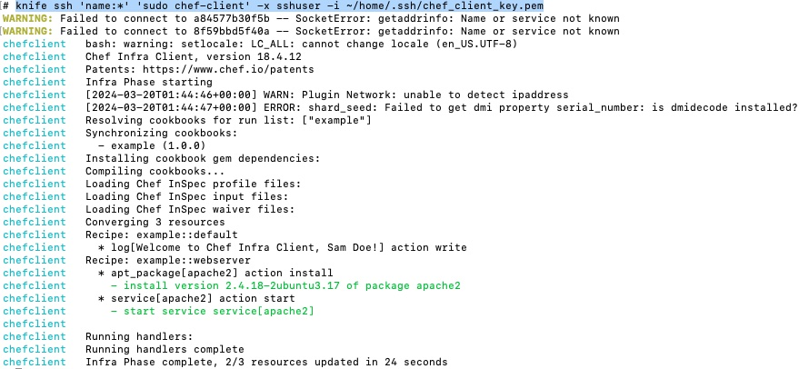
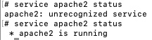

# Chef Server-Client Mode with Hosted Chef Docker Testing Env
### Objectives:
Built on-top of the Local Mode, this project setups a testing environment for Chef server-client mode using containization. 

#### Steps:
##### Hosted Chef Registration
Register a Hosted Chef account and create a Chef organization, then download the Starter Kit. 

This step is important to allow Chef Station connects to the Hosted Chef (i.e. Chef Server) to upload cookbooks, manage client nodes and execute cookbooks on client nodes. 

*Note: The Startet Kit contaiers a `.chef` folder with `config.rb` and a `.pem` key file.
Chef Station Setup:*

##### Chef Station Setup
1. Copy the `.pem` key as `chefstation_client_key.pem` in to project root. Alternatively, you could update the path of key file in `compose.yaml`/`secrets` section. 
2. In the `config.rb` file, copy values of `chef_server_url` and `node_name` field, and fill the values to `.env` file. 

##### Prepare Key Pairs for Chef Station to SSH connecting to Chef Client for bootstraping.
1. Generate SSH key pair `ssh-keygen -t rsa -b 4096 -C "chef_client" -f chef_client_key`

Note: The private and public keys are created as Docker Secrets and defined in `compose.yaml` file. They are mounted to the containers at runtime. If you used a different key file name, make sure update related fields. 

##### Bootstrap Chef Client:
Note: During the image building process of Chef Client, user `sshuser` had been created to take remote connections. 
1. Run `docker-compose up` to launch one container each for Chef Station and Chef Client. 
* Note: Both containers are running `tty` for you to interact with them. 

2. Execute `knife bootstrap chefclient -N node-01 -U sshuser -i ~/home/.ssh/chef_client_key.pem --sudo` in Chef Station container.
3. Verify that Chef Client bootstrap is completed successfuly via running `chef-client --version` in Chef Client container. 

##### Testing
1. Upload Cookbooks to Chef Server. `knife upload cookbooks --chef-repo-path ./`
2. Assign Runlist to Chef Client. `knife node run_list add node-01 "example"`
3. Signal Chef Client to pull changes from Chef Station. 
`knife ssh 'name:*' 'sudo chef-client' -x sshuser -i ~/home/.ssh/chef_client_key.pem`
4. Verify in Chef Client that actions defined in cookbook get executed. 
Note: In this example, an expected outcome should be apache2 service get installed and start running. Run `service apache2 status` in Chef Client to verify. 

	
	

