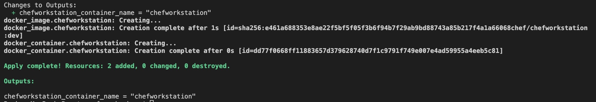

# Chef Local Mode Run Cookbook in Docker
### Objectives:
Build Docker image based on [chef/chefworkstation](https://hub.docker.com/r/chef/chefworkstation)  and run container to execute user-defined Chef recipe to configure container. 

Note: 
This demo is done using Terraform Docker Provider. 

#### Steps:
- `terraform init`
- `terraform plan` and `terraform apply`
- Check outputs `chefworkstation_container_name` for container name and view container logs to find execution results. `docker logs <container_name>`

