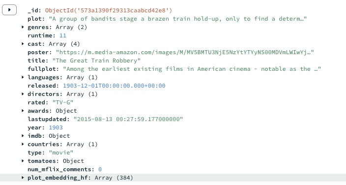
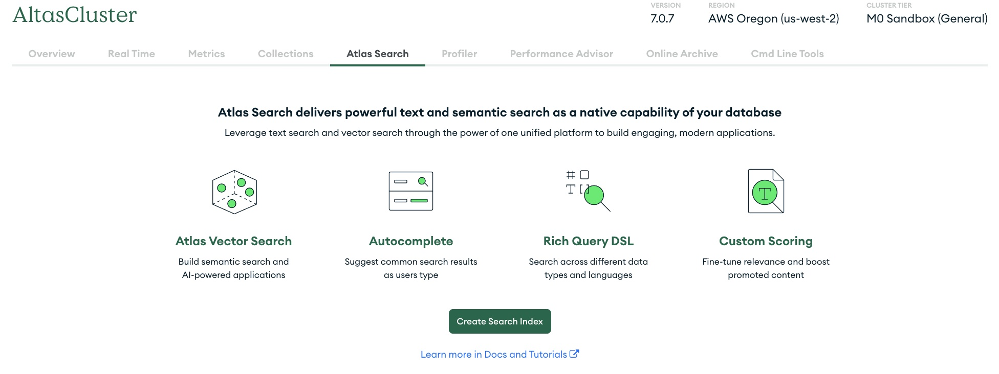

This project follows a [video tutorial](https://www.youtube.com/watch?v=JEBDfGqrAUA) published by freeCodeCamp.org to learn embeddings and semantic search. 
Embedding vectors are created using Hugging Face [sentence-transformers/all-MiniLM-L6-v2](https://huggingface.co/sentence-transformers/all-MiniLM-L6-v2) model, and generated vectors are stored in MongoDB Altas (free-tier). 

The model maps sentences and paragraphs to a 384 dimensional dense vector space, and can be used for tasks like semantic search.
Make sure you have a Hugging Face API token ready for use and fill it in the `.env` file.

This experiment has been using sample data, `sample_mflix.movies`, provided by MongoDB. 
The sample data of `sample_mflix.movies` contains a `plot` field, whose value would used to generate embeddings in order to allow searching movies by similar plots.
```
{
  "_id": { "$oid": "573a1390f29313caabcd42e8" },
  "plot": "A group of bandits stage a brazen train hold-up, only to find a determined posse hot on their heels.",
  "genres": ["Short", "Western"],
  "runtime": { "$numberInt": "11" },
  "cast": [
    "A.C. Abadie",
    "Gilbert M. 'Broncho Billy' Anderson",
    "George Barnes",
    "Justus D. Barnes"
  ],
  "poster": "https://m.media-amazon.com/images/M/MV5BMTU3NjE5NzYtYTYyNS00MDVmLWIwYjgtMmYwYWIxZDYyNzU2XkEyXkFqcGdeQXVyNzQzNzQxNzI@._V1_SY1000_SX677_AL_.jpg",
  "title": "The Great Train Robbery",
  "fullplot": "Among the earliest existing films in American cinema - notable as the first film that presented a narrative story to tell - it depicts a group of cowboy outlaws who hold up a train and rob the passengers. They are then pursued by a Sheriff's posse. Several scenes have color included - all hand tinted.",
  "languages": ["English"],
  "released": { "$date": { "$numberLong": "-2085523200000" } },
  "directors": ["Edwin S. Porter"],
  "rated": "TV-G",
  "awards": {
    "wins": { "$numberInt": "1" },
    "nominations": { "$numberInt": "0" },
    "text": "1 win."
  },
  "lastupdated": "2015-08-13 00:27:59.177000000",
  "year": { "$numberInt": "1903" },
  "imdb": {
    "rating": { "$numberDouble": "7.4" },
    "votes": { "$numberInt": "9847" },
    "id": { "$numberInt": "439" }
  },
  "countries": ["USA"],
  "type": "movie",
  "tomatoes": {
    "viewer": {
      "rating": { "$numberDouble": "3.7" },
      "numReviews": { "$numberInt": "2559" },
      "meter": { "$numberInt": "75" }
    },
    "fresh": { "$numberInt": "6" },
    "critic": {
      "rating": { "$numberDouble": "7.6" },
      "numReviews": { "$numberInt": "6" },
      "meter": { "$numberInt": "100" }
    },
    "rotten": { "$numberInt": "0" },
    "lastUpdated": { "$date": { "$numberLong": "1439061370000" } }
  },
  "num_mflix_comments": { "$numberInt": "0" }
}
```

Steps:
- `pip install -r requirements.txt`
- `python3 db.py` to connect to db. 
- `python3 embeddings.py` to generate embedding vectors. 
    Verify weather the embeddings are properly generated and stored in MongoDB Atlas. 
    
    

- Create a vector search index for your database in MongoDB dashboard
    
    
    
    Note: If the `Index Name` you used here is different from "PlotSemanticSearch", make sure that you sync the index name to the .env file. 
    `dynamic` indicates mongoDB should automatically index all fields in the documents added to the specified collection.
    `fields` should contain all the fields in the documents that we want to index. For each field, dimensionality need to be specified, it is important for indexing and search algorithms to function correctly. `dotProduct` means the dot product between vectors will be used to measure how similar they are. Higher dot product indicates a greater similarity. `knnVector` represents K nearest neighbor vector.

- `python3 query.py` to perform a vector search based on semantic similarity between `plot_embedding_hf` field and a custome defined query.
- View the response for movies that have similar plot to the input query. 
    Given input query "imaginary characters from outer space at war", below responses were returned.
    ```
    Movie Name: Four Sons,
    Movie Plot: A family saga in which three of a Bavarian widow's sons go to war for Germany and the fourth goes to America, Germany's eventual opponent.

    Movie Name: The Strong Man,
    Movie Plot: A meek Belgian soldier (Harry Langdon) fighting in World War I receives penpal letters and a photo from "Mary Brown", an American girl he has never met. He becomes infatuated with her by ...

    Movie Name: The Four Horsemen of the Apocalypse,
    Movie Plot: An extended family split up in France and Germany find themselves on opposing sides of the battlefield during World War I.

    Movie Name: In the Land of the Head Hunters,
    Movie Plot: Original advertising for the film describes it as a drama of primitive life on the shores of the North Pacific...
    ```

