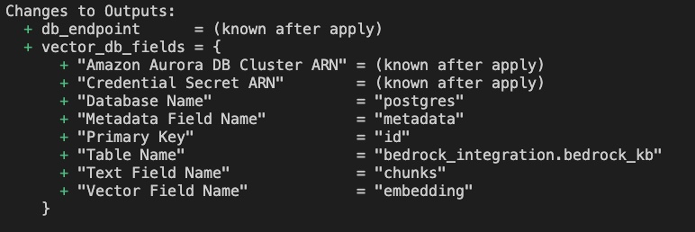

This project is created for Vancouver Cloud Summit 2024 AI Demo - AWS Bedrock Knowledgebase, and it's mainly used to create a vector database in Aurora Serverless V2 for the Demo environment setup. 

**The full tutorial could be found [here](https://scribehow.com/shared/RAG_and_Semantics_Search_in_AWS_Bedrock_Knowledge_Base_and_Aurora_Serverless__EAbl7VS0RjaUPfkpoBBFCA).**

## Steps to create a Vector Database in Aurora Serverless V2:
- `terraform init`
- `./manifest/terraform.tfvars` fill in your AWS profile name to `aws_profile` field. If you would like to use an existing S3 bucket, update the `create_bucket` to `false`. 
- Once Terrform is successfully initialized, run `terraform apply --auto-approve` to provision the AWS resources.

The AWS resources mainly include: a VPC consists of two public subnets, a Aurora Serverless cluster with PostgreSQL engine 15.4 (required to install vector database extension), 2 secrets in Secrets Managers (one for master user and Bedrock access respectively), and a S3 bucket to store custom data.

`prepare_db.sql` contains SQL statements to install the vector extension, create db user for Bedrock accessing, and a vector table `bedrock_integration.bedrock_kb`. The table's fields are defined based on [AWS insturctions](https://docs.aws.amazon.com/AmazonRDS/latest/AuroraUserGuide/AuroraPostgreSQL.VectorDB.html), which are `id`, `embedding`, `chunks` and `metadata`. These fields are required when creating a knowledge base in Bedrock to properly store embeddings into the table. 

The provision takes around 10 mins to complete, and you should have outputs like below.
    

Other Useful Links:

- [Set up a vector index for your knowledge base in a supported vector store](https://docs.aws.amazon.com/bedrock/latest/userguide/knowledge-base-setup.html)
- [Full Tutorial of the Demo](https://scribehow.com/shared/RAG_and_Semantics_Search_in_AWS_Bedrock_Knowledge_Base_and_Aurora_Serverless__EAbl7VS0RjaUPfkpoBBFCA)